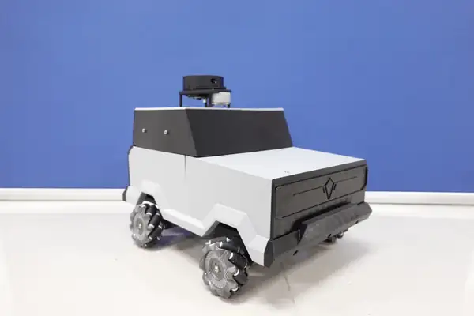
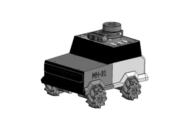

# MH-VF3

  
  

  <b>MH-01 Real Robot</b> &nbsp;&nbsp;&nbsp;&nbsp; <b>MH-01 CAD Model</b>

MH-VF3 is a mobile robot platform based on ROS 2 and micro-ROS.

## Firmware documentation

The original full firmware README has been preserved here: [README_firmware.md](README_firmware.md).
